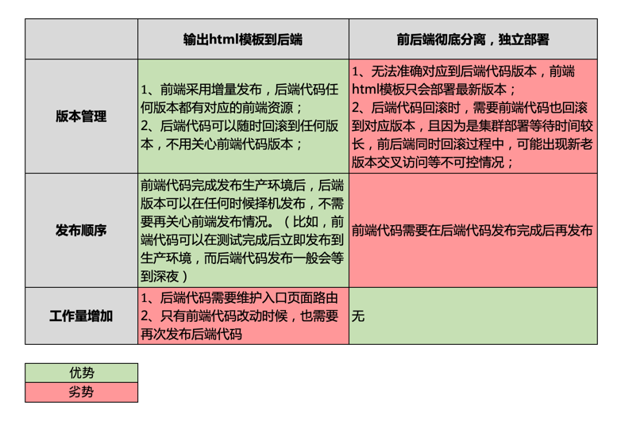

# easi-assets-deploy

EASI 前端静态资源部署工具。原理及流程请参考 [EASI Web 静态资源部署方案](https://www.notion.so/Web-e87a55d8236749208ff9d5a75e17ed76)。

## 安装

```shell
$ yarn add https://github.com/infinitasx/easi-assets-deploy.git#main
```

安装完成后，会在项目根目录生成 CI 所需要的`.github`目录和`.easi.yaml`文件，同时在`package.json`中生成部署静态资源需要的配置项：

```json
{
  "easiAssetsDeployConfig": {
    "backend": {
      "projectName": "",
      "repositoryUrl": "",
      "templateDir": "",
      "branchName": ""
    },
    "assetsFilePattern": "*.html",
    "asLibrary": false
  }
}
```

## 配置

一般情况下，前端项目会配合后端项目进行部署，需要配置`backend`相关参数。如果`backend`个参数保留默认值，则只会对前端静态资源进行发布。

- `backend.projectName`：后端项目克隆代码时的目录名称，与后端项目名称相同，也可以自定义。默认值`''`
- `backend.repositoryUrl`：后端项目仓库地址。默认值`''`
- `backend.templateDir`：模板文件存放目录，后端项目根目录相对路径。默认值`''`
- `backend.branchName`：每次功能发布时，对应的后端分支名称，优先级低于使用 [easi-auto-tag](https://github.com/infinitasx/easi-auto-tag) 时指定的后端分支名称。默认值`''`
- `assetsFilePattern`：向`backend.templateDir`复制文件的通配符，可以是字符串或数组，默认值`'*.html'`。比如：`'.'`表示`dist`目录所有文件，`'*.html'`表示所有 HTML 文件，`['*.html']`同上，`['*.html', '*.jpg']`etc.
- `asLibrary`：当一个前端项目作为独立库发布时配置此项，默认值`false`。发布后，在 CDN 目录里会根据`package.json`文件`version`字段保持各版本独立，比如：`/a-library-project/1.0.0/index.js`，`/a-library-project/1.1.0/index.js`

构建后，后端项目模板文件存放目录结构如下：

```
/index.html
/another_template.html
/testing/index.html
/testing/another_template.html
/production/index.html
/production/another_template.html
```

## 使用

基于 EASI CMDB 标准发布流程，`git tag v*`并`push`即可。前端项目推荐使用 [easi-auto-tag](https://github.com/infinitasx/easi-auto-tag) 。

在构建阶段，工具会注入`EASI_BUILD_ENV`和`EASI_ASSETS_CDN`两个环境变量，在项目`vue.config.js`中，可根据变量值编写构建逻辑。

- `EASI_BUILD_ENV`：构建环境。测试环境为`'testing'`，生产环境为`'production'`
- `EASI_ASSETS_CDN`：CDN 地址。测试环境为`'https://static.melbdelivery.com'`，生产环境为`'https://static.easiglobal.com'`

## FAQ

- 前后端分离的趋势下，为什么仍然要选择**向后端项目输出html模板**这种耦合部署方式？

  
